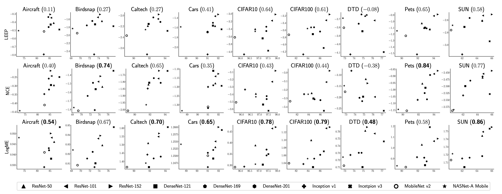
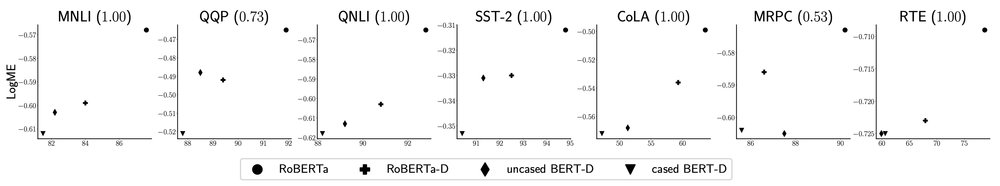
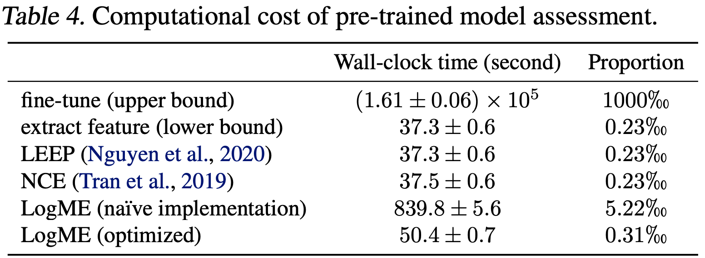

# LogME
LogME: Practical Assessment of Pre-trained Models for Transfer Learning, ICML 2021

# How to use

The API looks like sci-kit learn: first initialize an object, and then fit it to your data.

By fitting the features ``f`` and labels ``y``, and you can get a nice score which well correlates with the transfer learning performance (without hyper-parameter tuning).

```python
from LogME import LogME
logme = LogME(regression=False)
score = logme.fit(f, y)
```

Then you can use the ``score``  to quickly select a good pre-trained model. The larger the ``score`` is,  the better transfer performance you get.

# Experimental results

We extensively validate the generality and superior performance of LogME on 14 pre-trained models and 17 downstream tasks, covering various pre-trained models (supervised pre-trained and unsupervised pre-trained), downstream tasks (classification and regression), and modalities (vision and language). Check the paper for all the results.

## Computer vision

9 datasets and 10 pre-trained models. LogME is a reasonably good indicator for transfer performance.



## NLP

7 tasks and 4 pre-trained models. LogME is a good indicator for transfer performance.



# Speedup

LogME provides a dramatic speedup for assessing pre-trained models. The speedup comes from two aspects:

- LogME does not need hyper-parameter tuning whereas vanilla fine-tuning requires extensive hyper-parameter tuning.
- We designed a fast algorithm to further speedup the computation of LogME.




# Citation

If you find it useful, please cite the following paper:

```
@inproceedings{you_logme:_2021,
	title = {LogME: Practical Assessment of Pre-trained Models for Transfer Learning},
	booktitle = {ICML},
	author = {You, Kaichao and Liu, Yong and Wang, Jianmin and Long, Mingsheng},
	year = {2021}
}
```

# Contact

If you have any question or want to use the code, please contact youkaichao@gmail.com .